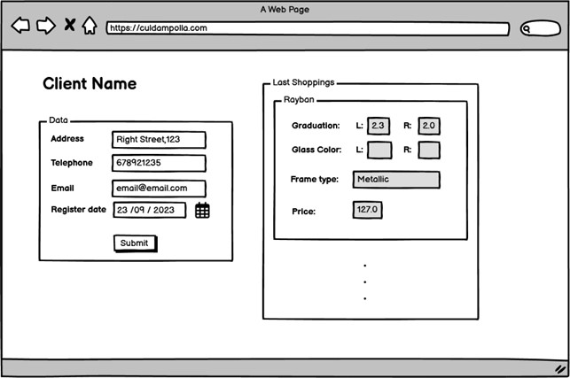
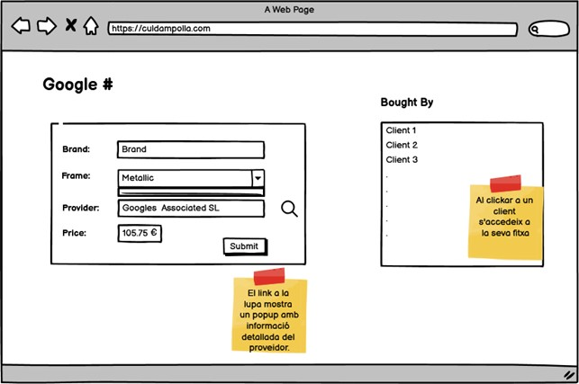

# Descripción

Modelarem diversos diagrames entitat-relació.

## Nivel 1 - Òptica ✔️

Una òptica, anomenada “Cul d'Ampolla”, vol informatitzar la gestió dels clients/es i vendes d'ulleres.

- En primer lloc, l'òptica vol saber quin és el proveïdor de cadascuna de les ulleres. En concret vol saber de cada proveïdor: El nom, l'adreça (carrer, número, pis, porta, ciutat, codi postal i país), telèfon, fax, NIF.

- De les ulleres es vol saber: La marca, la graduació de cadascun dels vidres, el tipus de muntura (flotant, pasta o metàl·lica), el color de la muntura, el color de cada vidre i el preu.

- Dels clients/es vol emmagatzemar: El nom, l'adreça postal, el telèfon, el correu electrònic, la data de registre.

- Quan arriba un/a client/a nou, emmagatzemar el/la client/a que li ha recomanat l'establiment (sempre que algú li hagi recomanat).

- El nostre sistema haurà d’indicar qui ha sigut l’empleat/da que ha venut cada ullera. Defineix quin dia/hora es fa la venda.

### Exercici 1 ✔️

Imagina que tenim la següent interfície gràfica, des del punt de vista d’un client de l'Òptica. 



Com dissenyaries la base de dades que facilités la informació?

### Exercici 2 ✔️

I si el punt de vista fos de la interfície fossin les ulleres?



## Nivel 2 ✔️

### Exercici 1 - Restaurante

T’han contractat per a dissenyar una web que permeti fer comandes de menjar a domicili per Internet.

Tingues en compte les següents indicacions per a modelar com seria la base de dades del projecte:

- Per a cada client/a emmagatzemem un identificador únic: Nom, cognoms, adreça, codi postal, localitat, província, número de telèfon.

- Una persona pot realitzar moltes comandes, però una única comanda només pot ser realitzat per una única persona. De cada comanda s'emmagatzema un identificador únic: Data/hora de realització, si la comanda és per a repartiment a domicili o per a recollir en botiga, la quantitat de productes que s'han seleccionat de cada tipus, el preu total a més d’una nota amb informació addicional.

- Una comanda pot constar d'un o diversos productes.


- Els productes poden ser pizzes, hamburgueses i begudes. De cada producte s'emmagatzema un identificador únic: Nom, descripció, imatge, preu. En el cas de les pizzes existeixen diverses categories que poden anar canviant de nom al llarg de l'any.

- Una comanda és gestionada per una única botiga i una botiga pot gestionar moltes comandes. De cada botiga s'emmagatzema un identificador únic: Adreça, codi postal, localitat, província.


- En una botiga poden treballar molts empleats/des i un empleat/da només pot treballar en una botiga. De cada empleat/da, s'emmagatzema un identificador únic: Nom, cognoms, NIF, Telèfon, si treballa com a cuiner/a o repartidor/a. 

- Per a les comandes de repartiment a domicili interessa guardar qui és el repartidor/a que fa el lliurament de la comanda i la data/hora del moment del lliurament.

## Nivel 3 - Youtube

Tractarem de fer un model senzill de com seria la base de dades per a una versió reduïda de YouTube.

- De cada usuari/ària guardem un identificador únic: Email, contrasenya, nom d'usuari/ària, data de naixement, sexe, país, codi postal.

- Un usuari/ària publica vídeos. De cada vídeo guardem un identificador únic: Un títol, una descripció, una grandària, el nom de l'arxiu de vídeo, durada del vídeo, un thumbnail, el nombre de reproduccions, el número de likes, el número de dislikes.

- Un vídeo pot tenir tres estats diferents: públic, ocult i privat. Un vídeo pot tenir moltes etiquetes. Interessa guardar qui és l'usuari/ària que publica el vídeo i en quina data/hora el fa.

- Un usuari/ària pot crear un canal. Un canal té un identificador únic: Un nom, una descripció, una data de creació.

- Un usuari/ària es pot subscriure als canals d'altres usuaris/es. Un usuari/ària pot fer-li un like o un dislike a un vídeo una única vegada. Caldrà portar un registre dels usuaris/es que li han fet like i dislike a un determinat vídeo i en quina data/hora ho van fer.

- Un usuari/ària pot crear playlists amb els vídeos que li agraden. Cada playlist té un identificador únic: Un nom, una data de creació, un estat que indica que pot ser pública o privada.

- Un usuari/ària pot escriure comentaris en un vídeo determinat. Cada comentari està identificat per un identificador únic: El text del comentari, la data/hora en la qual es va realitzar.

# Diseño y creación de DB con MongoDB

## 💻 Tecnologías Utilizadas

- MongoDB
- MOngoDB Compass

## 🔑 Requisitos

- Tener versión compatible de MOngoDB instalada
- Opcional: Tener alguna herramientas de manejo de DB como MOngoDB Compass

## ☕ Instalación

1. Clona el repositorio en tu máquina local:
   ```sh
   git clone https://github.com/soughtsingularity/Sprint-2/tree/main/Entrega_3_mongodb_estructura

2. Navega al directorio del proyecto:

```cd tu_repositorio```
